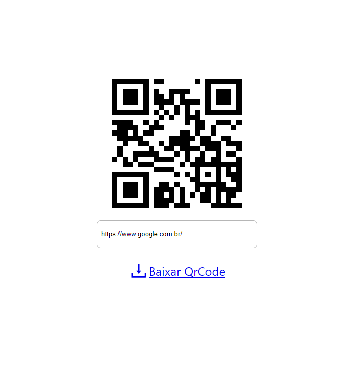

# Gerador de QR Code com ReactJS

[](https://wakatime.com/badge/user/268de5b9-4dbd-4873-9ede-a165e5745754/project/9ef7b6c4-80ab-4866-be52-b446eedd73d3)

Este projeto é um **gerador de QR Code** desenvolvido com **ReactJS**, uma biblioteca JavaScript amplamente utilizada para a criação de interfaces de usuário. O projeto permite que o usuário insira um texto ou URL e gere um código QR correspondente.

## Funcionalidades

- **Geração de QR Code:** O usuário pode inserir um link ou texto para gerar o código QR correspondente.
- **Download:** Após gerar o QR Code, o usuário pode baixar o código como um arquivo PNG.
- **Interface intuitiva:** Fácil de usar, com um campo de entrada para o link e um botão para download do QR Code gerado.

## Como Usar

1. Clone este repositório:

   ```bash
   git clone https://github.com/DevFullStack-Franklyn-R-Silva/gerador-qr-code.git
   ```

2. Navegue até a pasta do projeto e instale as dependências:

   ```bash
   cd gerador-qr-code
   npm install
   ```

3. Inicie o servidor local:

   ```bash
   npm start
   ```

4. O servidor será iniciado e você poderá acessar o gerador de QR Code no navegador através do endereço [http://localhost:3000](http://localhost:3000).

5. Para gerar um QR Code:
   - Insira um link ou texto na caixa de entrada.
   - Clique no botão "Gerar QR Code".
   - O código QR será gerado abaixo do campo de entrada e você poderá baixá-lo clicando no botão "Baixar QR Code".

**Veja o site em funcionamento [clicando aqui](https://gerador-de-qr-code-reactjs.netlify.app/)**.

## Tecnologias Utilizadas

- **ReactJS**: Framework JavaScript para criação de interfaces de usuário.
- **JavaScript**: Linguagem principal do projeto.
- **HTML**: Estrutura da página.
- **CSS**: Estilização da página.
- **react-qr-code**: Biblioteca para gerar o QR Code.
- **qrcode**: Biblioteca auxiliar para gerar URLs de QR Codes.
- **react-icons**: Biblioteca para ícones.

## Como Contribuir

Fique à vontade para contribuir com este projeto! Para isso, siga os seguintes passos:

1. Faça um fork deste repositório.
2. Realize as alterações desejadas.
3. Envie um pull request.

## Imagem do Projeto

<div>
    
</div>

## Bibliotecas Utilizadas

- **react-qr-code**:

  ```bash
  yarn add react-qr-code
  ```

- **qrcode**:

  ```bash
  yarn add qrcode
  ```

- **react-icons**:
  ```bash
  npm install react-icons
  ```

## Estrutura de Scripts

### `npm start`

Inicia a aplicação no modo de desenvolvimento. Acesse [http://localhost:3000](http://localhost:3000) no seu navegador para visualizar.

### `npm test`

Roda os testes no modo interativo. Consulte a [documentação sobre como rodar testes](https://facebook.github.io/create-react-app/docs/running-tests).

### `npm run build`

Cria uma versão otimizada para produção na pasta `build`, preparada para ser implantada.

### `npm run eject`

**Aviso:** Esta ação não pode ser desfeita. Ao usar o comando `eject`, você terá controle total sobre a configuração do build, mas a partir desse momento não poderá mais retornar ao estado anterior.

## Aprenda Mais

Você pode aprender mais sobre o **Create React App** na [documentação oficial](https://facebook.github.io/create-react-app/docs/getting-started).

Para aprender React, consulte a [documentação oficial do React](https://reactjs.org/).
